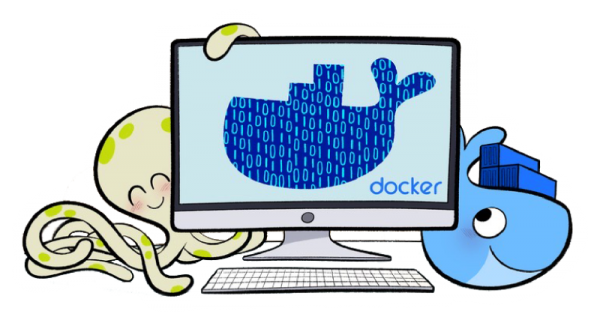

<p align="center">
  <a href="#">
    
    <h1 align="center">Local Development Docker</h1>
  </a>
</p>

<p align="center">
  <a href="#">
    
  </a>

  <a href="#">
    
  </a>

  <a href="#">
    
  </a>

  <a href="#">
    
  </a>

  <a href="#">
    
  </a>

  <a href="#">
    
  </a>
</p>

## Table of contents

- [Table of contents](#table-of-contents)
- [Quick start](#quick-start)
- [Bugs and feature requests](#bugs-and-feature-requests)
- [Contributing](#contributing)
- [Creators](#creators)
- [Copyright and license](#copyright-and-license)

## Quick start

`local-dev-docker` is a Docker-based tool to allow developers running app maintenance scripts inside containers.

When you run `local-dev-docker [IMAGE] [COMMAND]` in your current directory, it will mount it as delegated volume, together with some of your `$HOME` files(*) and folders needed to run tasks like `git push`, `npm publish`, `composer install`, etc. which usually require credentials.

(*)*Mounts (read-only): `~/.ssh`, `~/.npmrc`, `~/.composer/auth.json`, `~/.gitconfig`, `~/.gitignore_global`*

## Setup

```bash
npm i -g git+https://github.com/allanavelar/local-dev-docker.git && \
local-dev-docker-init
```

## Supported Languages

Node & npm:

- `node`
- `node:15`
- `node:16`
- `node:latest`
- `npm` (runs on `node:latest`)

PHP & composer:

- `php`
- `php:7`
- `php:8`
- `php:latest`
- `composer` (runs on `php:latest`)

## Usage

```bash
# Usage template:
local-dev-docker [LANG]:[VERSION] [COMMAND] [...PARAMETERS]
```

```bash
# Examples:
local-dev-docker node:16 node --version
local-dev-docker node npm install
local-dev-docker npm install

local-dev-docker php:8 php --ini
local-dev-docker php composer install
local-dev-docker composer install
```

## Bugs and feature requests

Have a bug or a feature request? Please first read the [issue guidelines](./contributing.md) and search for existing and closed issues. If your problem or idea is not addressed yet, [please open a new issue](https://github.com/allanavelar/local-dev-docker/issues/new).

## Contributing

Please read through our [contributing guidelines](./contributing.md). Included are directions for opening issues, coding standards, and notes on development.

Moreover, all HTML and CSS should conform to the [Code Guide](./code-guide.md), maintained by [Main author](https://github.com/allanavelar).

Editor preferences are available in the [editor config](./.editorconfig) for easy use in common text editors. Read more and download plugins at <https://editorconfig.org/>.

## Creators

[](https://github.com/allanavelar) |
--- |
[▲▼ Allan Avelar ۞](https://github.com/allanavelar)|

## Copyright and license

Code released under the [MIT License](./license.md).

<a href="./license.md"></a>

Enjoy :metal:
